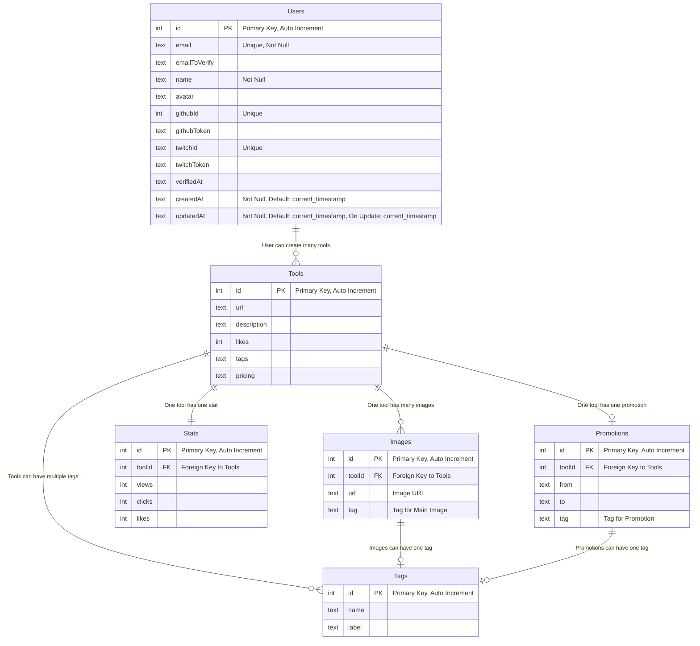

# NuxtHub Starter Template

This starter lets you get started with [NuxtHub](https://hub.nuxt.com) in seconds.

- [Documentation](https://hub.nuxt.com)

## Features

- Image upload with [`hubBlob()`](http://hub.nuxt.com/docs/storage/blob)
- Save chat messages with [`hubDatabase()`](http://hub.nuxt.com/docs/storage/database)
- Save server redirects with [`hubKV()`](http://hub.nuxt.com/docs/storage/kv)
- Cache an API response with [`cachedEventHandler()`](https://hub.nuxt.com/docs/server/cache)
- Generate the API documentation with Scalar within the [NuxtHub Admin](https://admin.hub.nuxt.com)

## Setup

Make sure to install the dependencies with [pnpm](https://pnpm.io).

```bash
pnpm install
```

## Development Server

Start the development server on `http://localhost:3000`:

```bash
pnpm dev
```

## Production

Build the application for production:

```bash
pnpm build
```

Check out the [deployment documentation](https://hub.nuxt.com/docs/getting-started/deploy) for more information.

## Deploy

Deploy the application on the Edge with [NuxtHub](https://hub.nuxt.com) on your Cloudflare account:

```bash
npx nuxthub deploy
```

Then checkout your server logs, analaytics and more in the [NuxtHub Admin](https://admin.hub.nuxt.com).

You can also deploy using [Cloudflare Pages CI](https://hub.nuxt.com/docs/getting-started/deploy#cloudflare-pages-ci).


--- 

##Database  overview



